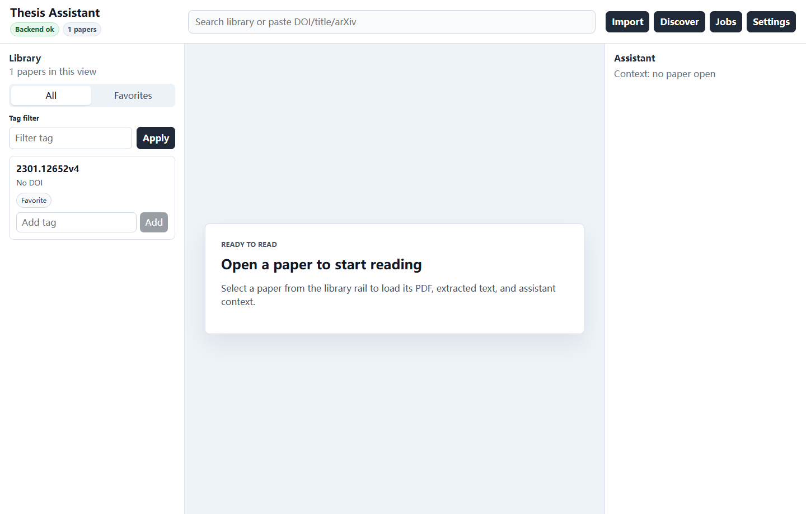
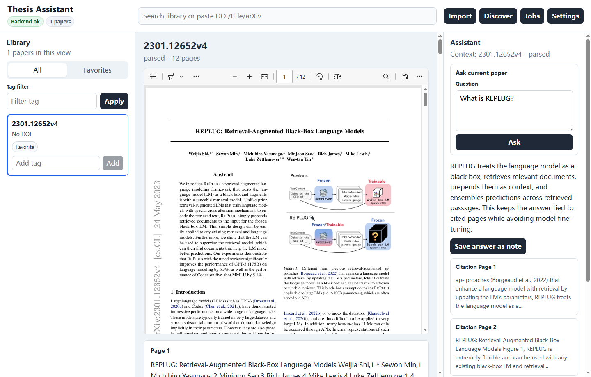

# Thesis Assistant

Windows-first desktop literature library and research assistant for local PDF collections.



Thesis Assistant helps you keep papers on your own machine, search across them, read PDFs, ask cited questions about the current paper, and turn selected passages into translations, explanations, highlights, or notes.

## Why Thesis Assistant

- Local managed library for PDFs, metadata, notes, highlights, and provider settings.
- Reader-centered desktop workspace instead of a browser control panel.
- Current-paper Q&A that automatically reads the open paper and returns page-level citations.
- Literature discovery across OpenAlex, Crossref, Semantic Scholar, arXiv, and Unpaywall, with open PDF download and import.
- OpenAI-compatible and Ollama model provider settings, including optional proxy support.

## Screenshots



The reader view keeps the PDF visible, exposes extracted text for selection, and shows assistant answers with compact citation cards.

## Install

For private Windows builds, use the NSIS installer produced by the release script:

```powershell
.\scripts\build-release.ps1
```

The installer is written under:

```text
apps\desktop\src-tauri\target\release\bundle\nsis
```

The release script prints the installer path and SHA-256 checksum. The installer is currently unsigned, so Windows SmartScreen may show an unknown publisher warning. Public distribution should add code signing.

## Quick Start

1. Open the desktop app.
2. Click `Settings` and choose a local library folder.
3. Click `Import` to add a PDF, folder, or bibliography file.
4. Open a paper from the library rail.
5. Select text in the extracted layer to `Translate`, `Explain`, `Highlight`, or save a `Note`.
6. Configure a model provider in `Settings`, then ask questions in the assistant rail.
7. Click citation cards to jump back to the cited page context.

## Features

- PDF import by local path with hash-based duplicate detection.
- Recursive folder import with background job tracking and retry.
- BibTeX and RIS import/export.
- Metadata search and extracted-page local search.
- Persistent local vector index under `indexes/vectors/` for semantic search fallback.
- Managed PDF preview plus extracted text reader context.
- Current-paper assistant Q&A with cited snippets and page numbers.
- Streaming assistant progress in the desktop UI.
- Selected-text translation, explanation, and summarization.
- Notes and highlights for selected passages.
- Open PDF discovery and download from supported literature sources.
- Tauri desktop shell that starts the local Python backend.

## Privacy

The default library lives at `%USERPROFILE%\KnowledgeAgentLibrary`, or at `KA_LIBRARY_DIR` when set. PDFs, metadata, notes, highlights, local indexes, and provider settings stay in the selected local library.

API keys are stored in the local library database. They are never returned by the settings API and are not displayed by the desktop app. Assistant requests send only cited snippets or selected text according to the configured outbound context policy.

Generated installers, backend binaries, local libraries, source PDFs, and model API keys must not be committed.

## Model Settings

Open `Settings` and choose one provider:

- `OpenAI-compatible`: set `Base URL`, `Model`, and `API key`.
- `Ollama`: set the local Ollama base URL and model.
- `None`: disables assistant provider calls.

For OpenAI-compatible gateways, both gateway roots and API-prefixed URLs are accepted:

```text
https://example-gateway.test/
https://example-gateway.test/v1
```

If your network needs a local proxy, set `Proxy URL`, for example:

```text
http://127.0.0.1:7897
```

## Development

Prerequisites:

- Python 3.13
- Node.js 24 and npm
- Rust and Cargo

Start the desktop app from PowerShell:

```powershell
.\scripts\dev-desktop.ps1
```

The script prepares the Python virtual environment, installs `backend[dev]`, installs desktop dependencies when needed, and runs Tauri. Tauri starts the backend on `http://127.0.0.1:8765` unless another process is already listening there.

For backend-only development:

```powershell
.\scripts\dev-backend.ps1
```

For sidecar or packaged-backend experiments:

```powershell
$env:KA_BACKEND_PROGRAM='F:\bundle\knowledge-agent-backend.exe'
$env:KA_BACKEND_ARGS='--host 127.0.0.1 --port 8765'
.\scripts\dev-desktop.ps1
```

## Real PDF Smoke Test

Use the smoke script to verify a local PDF can be imported, parsed, and answered with current-paper citations through an OpenAI-compatible provider. The script reads secrets from environment variables.

```powershell
$env:KA_SMOKE_PDF='F:\path\to\paper.pdf'
$env:KA_SMOKE_BASE_URL='https://example-gateway.test/'
$env:KA_SMOKE_MODEL='your-model'
$env:KA_SMOKE_API_KEY='<your key>'
$env:KA_SMOKE_PROXY_URL='http://127.0.0.1:7897'
.\.venv\Scripts\python .\scripts\smoke_real_pdf.py
```

Omit `KA_SMOKE_LIBRARY_DIR` to use a temporary managed library.

## Tests

Backend:

```powershell
.\.venv\Scripts\python -m pytest backend/tests -q
```

Frontend:

```powershell
cd apps\desktop
npm test
npm run build
```

Rust desktop shell:

```powershell
cd apps\desktop\src-tauri
cargo test --locked
cargo check --locked
```

## Roadmap

- Code signing and public release workflow.
- Richer metadata editing and paper organization.
- Better citation export workflows.
- More robust PDF annotation synchronization.
- Optional local embedding/model integrations for fully offline workflows.
